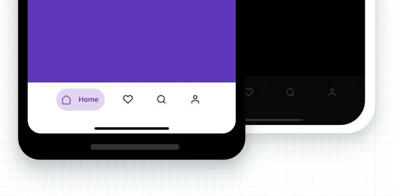

<div align="center">
<h1>Animated TabBar</h1>

[](https://www.npmjs.com/package/@gorhom/animated-tabbar) [](https://www.npmjs.com/package/@gorhom/animated-tabbar) [](https://www.npmjs.com/package/@gorhom/animated-tabbar)



A **60FPS** animated tab bar with a variety of cool animation presets 😎

</div>

---

## Table of Contents

1. [Features](#features)
2. [Installation](#installation)
3. [Usage](#usage)
   1. [Animated Icons](./docs/animated-icons.md)
4. [Props](#props)
5. [Presets](#presets)
   1. [Bubble Preset](./docs/bubble-preset.md)
   2. [Flashy Preset](./docs/flashy-preset.md)
   3. [Material Preset](./docs/material-preset.md)
6. [Migration](#migration)
7. [To Do](#to-do)
8. [Credits](#built-with)
9. [License](#license)

## Features

- `60FPS` smooth animation for all presets.
- Fully integrated with `React Navigation` v4 & v5.
- Standalone usage.
- Right-to-left layout support.
- Accessibility support.
- Written in `TypeScript`.

## Installation

```sh
yarn add @gorhom/animated-tabbar
# or
npm install @gorhom/animated-tabbar
```

> Also, you need to install [react-native-reanimated](https://github.com/software-mansion/react-native-reanimated), [react-native-gesture-handler](https://github.com/software-mansion/react-native-gesture-handler) & [react-native-svg](https://github.com/react-native-community/react-native-svg), and follow their installation instructions.

## Usage

Originally `Animated TabBar` worked only with `React Navigation`, but I notice that it could be use as a standalone component and be more useful for the community.

Now the library export two main components:

- `AnimatedTabBar` ( **default** ) : the `React Navigation` integrated tab bar.
- `AnimatedTabBarView`: the standalone tab bar.

<details>
  <summary>Standalone Component</summary>

```tsx
import React, { useState } from 'react';
import { View, Text, StyleSheet } from 'react-native';
import AnimatedTabBar, {TabsConfig, BubbleTabBarItemConfig} from '@gorhom/animated-tabbar';

const tabs: TabsConfig<BubbleTabBarItemConfig> = {
  Home: {
    labelStyle: {
      color: '#5B37B7',
    },
    icon: {
      component: /* ICON COMPONENT */,
      activeColor: 'rgba(91,55,183,1)',
      inactiveColor: 'rgba(0,0,0,1)',
    },
    background: {
      activeColor: 'rgba(223,215,243,1)',
      inactiveColor: 'rgba(223,215,243,0)',
    },
  },
  Profile: {
    labelStyle: {
      color: '#1194AA',
    },
    icon: {
      component: /* ICON COMPONENT */,
      activeColor: 'rgba(17,148,170,1)',
      inactiveColor: 'rgba(0,0,0,1)',
    },
    background: {
      activeColor: 'rgba(207,235,239,1)',
      inactiveColor: 'rgba(207,235,239,0)',
    },
  },
};

const styles = StyleSheet.create({
  container: {
    flex: 1,
    justifyContent: 'center',
    alignItems: 'center',
    backgroundColor: '#999',
  },
  tabBarContainer: {
    borderRadius: 25,
  },
});

export default function App() {
  const [index, setIndex] = useState(0);
  return (
    <View style={styles.container}>
      <Text>{index}</Text>
      <AnimatedTabBarView
        tabs={tabs}
        itemOuterSpace={{
          horizontal: 6,
          vertical: 12,
        }}
        itemInnerSpace={12}
        iconSize={20}
        style={styles.tabBarContainer}
        index={index}
        onIndexChange={setIndex}
      />
    </View>
  )
}
```

</details>
<details>
  <summary>React Navigation v5 (TypeScript)</summary>

```tsx
import React from 'react';
import { NavigationContainer } from '@react-navigation/native';
import { createBottomTabNavigator } from '@react-navigation/bottom-tabs';
import AnimatedTabBar, {TabsConfig, BubbleTabBarItemConfig} from '@gorhom/animated-tabbar';

const tabs: TabsConfig<BubbleTabBarItemConfig> = {
  Home: {
    labelStyle: {
      color: '#5B37B7',
    },
    icon: {
      component: /* ICON COMPONENT */,
      activeColor: 'rgba(91,55,183,1)',
      inactiveColor: 'rgba(0,0,0,1)',
    },
    background: {
      activeColor: 'rgba(223,215,243,1)',
      inactiveColor: 'rgba(223,215,243,0)',
    },
  },
  Profile: {
    labelStyle: {
      color: '#1194AA',
    },
    icon: {
      component: /* ICON COMPONENT */,
      activeColor: 'rgba(17,148,170,1)',
      inactiveColor: 'rgba(0,0,0,1)',
    },
    background: {
      activeColor: 'rgba(207,235,239,1)',
      inactiveColor: 'rgba(207,235,239,0)',
    },
  },
};

const Tab = createBottomTabNavigator();

export default function App() {
  return (
    <NavigationContainer>
      <Tab.Navigator
        tabBar={props => (
          <AnimatedTabBar tabs={tabs} {...props} />
        )}
      >
        <Tab.Screen
          name="Home"
          component={HomeScreen}
        />
        <Tab.Screen
          name="Profile"
          component={ProfileScreen}
        />
      </Tab.Navigator>
    </NavigationContainer>
  )
}
```

</details>

<details>
  <summary>React Navigation v5 (JavaScript)</summary>

```jsx
import React from 'react';
import { NavigationContainer } from '@react-navigation/native';
import { createBottomTabNavigator } from '@react-navigation/bottom-tabs';
import AnimatedTabBar from '@gorhom/animated-tabbar';

const tabs = {
  Home: { // < Screen name
    labelStyle: {
      color: '#5B37B7',
    },
    icon: {
      component: /* ICON COMPONENT */,
      activeColor: 'rgba(91,55,183,1)',
      inactiveColor: 'rgba(0,0,0,1)',
    },
    background: {
      activeColor: 'rgba(223,215,243,1)',
      inactiveColor: 'rgba(223,215,243,0)',
    },
  },
  Profile: { // < Screen name
    labelStyle: {
      color: '#1194AA',
    },
    icon: {
      component: /* ICON COMPONENT */,
      activeColor: 'rgba(17,148,170,1)',
      inactiveColor: 'rgba(0,0,0,1)',
    },
    background: {
      activeColor: 'rgba(207,235,239,1)',
      inactiveColor: 'rgba(207,235,239,0)',
    },
  },
};

const Tab = createBottomTabNavigator();

export default function App() {
  return (
    <NavigationContainer>
      <Tab.Navigator
        tabBar={props => (
          <AnimatedTabBar tabs={tabs} {...props} />
        )}
      >
        <Tab.Screen
          name="Home"
          component={HomeScreen}
        />
        <Tab.Screen
          name="Profile"
          component={ProfileScreen}
        />
      </Tab.Navigator>
    </NavigationContainer>
  )
}
```

</details>

<details>
  <summary>React Navigation v4</summary>

```tsx
import React from 'react';
import {createAppContainer} from 'react-navigation';
import {createBottomTabNavigator} from 'react-navigation-tabs';
import {SafeAreaProvider} from 'react-native-safe-area-context';
import AnimatedTabBar, {TabsConfig, BubbleTabBarItemConfig} from '@gorhom/animated-tabbar';

const tabs: TabsConfig<BubbleTabConfig> = {
  Home: {
    labelStyle: {
      color: '#5B37B7',
    },
    icon: {
      component: /* ICON COMPONENT */,
      activeColor: 'rgba(91,55,183,1)',
      inactiveColor: 'rgba(0,0,0,1)',
    },
    background: {
      activeColor: 'rgba(223,215,243,1)',
      inactiveColor: 'rgba(223,215,243,0)',
    },
  },
  Profile: {
    labelStyle: {
      color: '#1194AA',
    },
    icon: {
      component: /* ICON COMPONENT */,
      activeColor: 'rgba(17,148,170,1)',
      inactiveColor: 'rgba(0,0,0,1)',
    },
    background: {
      activeColor: 'rgba(207,235,239,1)',
      inactiveColor: 'rgba(207,235,239,0)',
    },
  },
};

const TabNavigator = createBottomTabNavigator(
  {
    Home: HomeScreen,
    Profile: ProfileScreen,
  },
  {
    tabBarComponent: props => <AnimatedTabBar tabs={tabs} {...props} />,
  },
);

const AppContainer = createAppContainer(TabNavigator);

export default () => (
  <SafeAreaProvider>
    <AppContainer />
  </SafeAreaProvider>
);
```

</details>

> To configure animated icons, please have a look at [Animated Icons](./docs/animated-icons.md).

## Props

| name                 | description                                                                                         | required | type                                                                                                      | default  |
| -------------------- | --------------------------------------------------------------------------------------------------- | -------- | --------------------------------------------------------------------------------------------------------- | -------- |
| `preset`             | Animation preset, currently options are `['bubble', 'flashy', 'material']`.                         | NO       | [`PresetEnum`](./src/presets.ts#L8)                                                                       | 'bubble' |
| `tabs`               | Tabs configurations. A generic dictionary of selected preset tab config.                            | YES      | [`TabsConfig<T>`](./src/types.ts#L5)                                                                      |          |
| `style`              | View style to be applied to tab bar container, `default value will be based on selected preset`.    | NO       | StyleProp<ViewStyle>                                                                                      |          |
| `duration`           | Animation duration, `default value will be based on selected preset`.                               | NO       | number                                                                                                    |          |
| `easing`             | Animation easing function, `default value will be based on selected preset`.                        | NO       | [`EasingFunction`](https://github.com/software-mansion/react-native-reanimated/blob/master/src/Easing.js) |          |
| `itemInnerSpace`     | Tab item inner space to be added to the tab item, `default value will be based on selected preset`. | NO       | number \| [`Space`](./src/types.ts#L29)                                                                   |          |
| `itemOuterSpace`     | Tab item outer space to be added to the tab item, `default value will be based on selected preset`. | NO       | number \| [`Space`](./src/types.ts#L34)                                                                   |          |
| `itemContainerWidth` | Tab item width stretch strategy, `default value will be based on selected preset`.                  | NO       | 'auto' \| 'fill'                                                                                          |          |
| `iconSize`           | Tab item icon size, `default value will be based on selected preset`.                               | NO       | number                                                                                                    |          |
| `isRTL`              | Tab bar layout and animation direction.                                                             | NO       | boolean                                                                                                   | false    |
| `onLongPress`        | Callback on item long press, `by default it is integrated with React Navigation`.                   | NO       | (index: number) => void                                                                                   | noop     |

### Preset Configurations

Some presets will have its own configurations - like `material` - which they will be added the root view props.

<details>

  <summary>Material Preset Example</summary>

notice here we added `animation`, `inactiveOpacity` & `inactiveScale` to the root view.

```tsx

import React from 'react';
import { NavigationContainer } from '@react-navigation/native';
import { createBottomTabNavigator } from '@react-navigation/bottom-tabs';
import AnimatedTabBar, {TabsConfig, MaterialTabBarItemConfig} from '@gorhom/animated-tabbar';

const tabs: TabsConfig<MaterialTabBarItemConfig> = {
Home: {
  icon: {
    component: /* ICON COMPONENT */,
    color: 'rgba(255,255,255,1)',
  },
  ripple: {
    color: '#5B37B7',
  },
},
Profile: {
  icon: {
    component: /* ICON COMPONENT */,
    color: 'rgba(255,255,255,1)',
  },
  ripple: {
    color: '#1194AA',
  },
},
};

const Tab = createBottomTabNavigator();

export default function App() {
return (
  <NavigationContainer>
    <Tab.Navigator
      tabBar={props => (
        <AnimatedTabBar
          tabs={tabs}
          animation="iconWithLabelOnFocus"
          inactiveOpacity={0.25}
          inactiveScale={0.5}
          {...props}
        />
      )}
    >
      <Tab.Screen
        name="Home"
        component={HomeScreen}
      />
      <Tab.Screen
        name="Profile"
        component={ProfileScreen}
      />
    </Tab.Navigator>
  </NavigationContainer>
)
}
```

</details>

## Presets

Originally `Animated TabBar` started with `Bubble` as the only animation preset embedded. However, I felt the library structure could include many other variety of animation presets.

### [Bubble Preset](./docs/bubble-preset.md)

<a href="./docs/bubble-preset.md"></a>

### [Flashy Preset](./docs/flashy-preset.md)

<a href="./docs/flashy-preset.md"></a>

### [Material Preset](./docs/material-preset.md)

<a href="./docs/material-preset.md"></a>

## Migration

<details>

  <summary>V1 to V2</summary>

Due to extend the library functionality, I had to rename existing interfaces as following:

- `BubbleTabConfig` to `BubbleTabBarItemConfig`
- `BubbleTabIconProps` to `BubbleTabBarIconProps`
- `FlashyTabConfig` to `FlashyTabBarItemConfig`
- `FlashyTabIconProps` to `FlashyTabBarIconProps`

</details>

## To Do

- [x] Add accessibility support.
- [ ] Add more presets (PR are welcome).

<h2 id="built-with">Built With ❤️</h2>

- [react-native-reanimated](https://github.com/software-mansion/react-native-reanimated)
- [react-native-gesture-handler](https://github.com/software-mansion/react-native-gesture-handler)
- [react-native-redash](https://github.com/wcandillon/react-native-redash)
- [react-native-svg](https://github.com/react-native-community/react-native-svg)
- [@react-native-community/bob](https://github.com/react-native-community/bob)

## Author

- [Mo Gorhom](https://gorhom.dev/)

## License

MIT

<div align="center">

Liked the library? 😇

<a href="https://www.buymeacoffee.com/gorhom" target="_blank"></a>

</div>

---

<p align="center">
<a href="https://gorhom.dev" target="_blank"></a>
</p>
