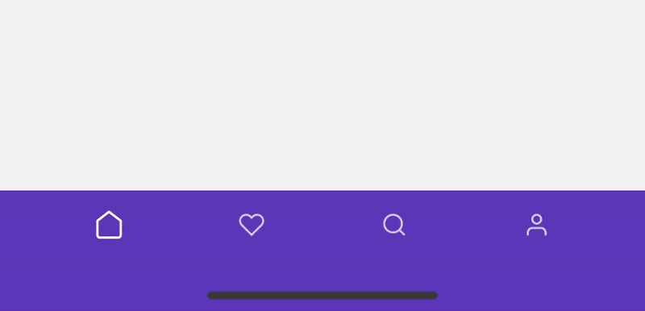
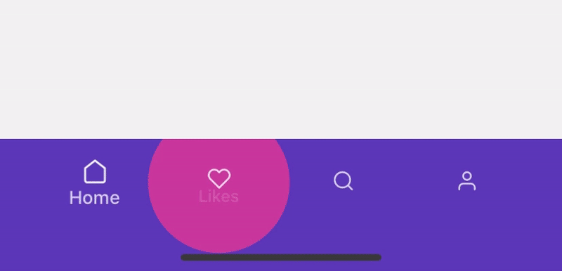

# Material Preset

> This preset is inspired by [timomeh](https://github.com/timomeh) works on [react-native-material-bottom-navigation](https://github.com/timomeh/react-native-material-bottom-navigation).

### Icon with label


### Icon only



### Icon with label on focus



## Interfaces

### MaterialTabBarConfig

| name              | description                            | required | type                                                    | default         |
| ----------------- | -------------------------------------- | -------- | ------------------------------------------------------- | --------------- |
| `animation`       | Material animation preset.             | NO       | `iconWithLabel` \| `iconOnly` \| `iconWithLabelOnFocus` | `iconWithLabel` |
| `inactiveOpacity` | Tab bar item inactive opacity.         | NO       | number                                                  | 0.75            |
| `inactiveScale`   | Tab bar item indicator configurations. | NO       | number                                                  | 0.85            |

<details>
  <summary>TypeScript Interface</summary>

```ts
export interface MaterialTabBarConfig {
  /**
   * Material animation preset.
   * @type {'iconWithLabel' | 'iconOnly' | 'iconWithLabelOnFocus'}
   * @default 'iconWithLabel'
   */
  animation?: 'iconWithLabel' | 'iconOnly' | 'iconWithLabelOnFocus';
  /**
   * Tab bar item inactive opacity.
   * @type {number}
   * @default 0.75
   */
  inactiveOpacity?: number;
  /**
   * Tab bar item inactive scale.
   * @type {number}
   * @default 0.85
   */
  inactiveScale?: number;
}
```

</details>

### MaterialTabBarItemConfig

| name         | description                                                  | required | type                | default       |
| ------------ | ------------------------------------------------------------ | -------- | ------------------- | ------------- |
| `labelStyle` | This will apply to the tab bar item label.                   | NO       | TextStyle           |               |
| `icon`       | Icon configurations.                                         | YES      | object              |               |
| `├component` | Icon component, this could be a function or class component. | YES      | [`ReactNode`](#L45) |               |
| `└color`     | Icon color.                                                  | YES      | string              |               |
| `ripple`     | Tab bar item ripple configurations.                          | YES      | object              |               |
| `└color`     | Ripple color.                                                | NO       | string              | `label color` |

<details>
  <summary>TypeScript Interface</summary>

```ts
export interface MaterialTabBarItemConfig {
  /**
   * Tab bar item label style.
   */
  labelStyle?: StyleProp<TextStyle>;
  /**
   * Tab bar item icon config.
   */
  icon: {
    /**
     * Tab bar item icon component, this could be a function or
     * a react node.
     * @type {(props: MaterialTabBarIconProps) => React.ReactNode | React.ReactNode}
     */
    component:
      | React.FC<MaterialTabBarIconProps>
      | React.ComponentClass<MaterialTabBarIconProps>
      | React.ReactNode;
    /**
     * Icon color.
     * @type {string}
     */
    color: string;
  };
  /**
   * Tab bar item ripple config.
   */
  ripple: {
    /**
     * Tab bar item ripple color.
     * @type {string}
     */
    color: string;
  };
}
```

</details>

### MaterialTabBarIconProps

| name            | description                        | required | type                    | default |
| --------------- | ---------------------------------- | -------- | ----------------------- | ------- |
| `animatedFocus` | Tab bar item animated focus value. | YES      | `Animated.Node<number>` |
| `color`         | Tab bar item icon color.           | YES      | number                  |         |
| `size`          | Tab bar item icon size.            | YES      | number                  |         |

<details>
  <summary>TypeScript Interface</summary>

```ts
export interface MaterialTabBarIconProps {
  /**
   * Tab bar item animated focus value.
   * @type {Animated.Node<number>}
   */
  animatedFocus: Animated.Node<number>;
  /**
   * Tab bar item icon color.
   * @type {string}
   */
  color: string;
  /**
   * Tab bar item icon size.
   * @type {number}
   */
  size: number;
}
```

</details>
